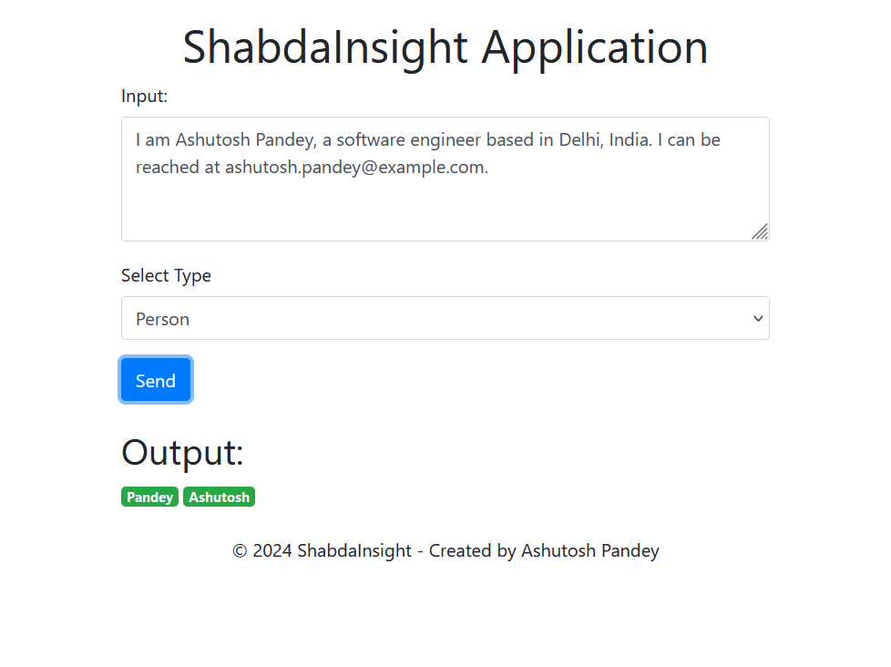
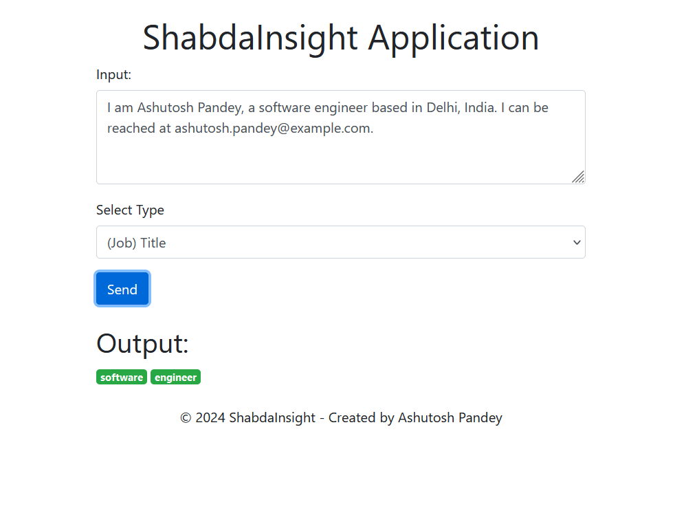

# ShabdaInsight - Named Entity Recognizer (NER) with Spring Boot

## Overview

ShabdaInsight is a Named Entity Recognizer (NER) application developed using Spring Boot. It identifies and classifies entities within text, including people, organizations, locations, and dates.

## Features

- **Named Entity Recognition (NER):** Efficiently recognizes entities in text.
- **Customizable:** Fine-tune entity recognition based on specific requirements.
- **Scalable:** Built on Spring Boot for easy deployment and scalability.

## Getting Started

### Prerequisites

- Java Development Kit (JDK) 8 or later
- Maven

### Installation

1. Clone the repository:

    ```bash
    git clone https://github.com/theashutoshpandey/ShabdaInsight.git
    ```

2. Build the project:

    ```bash
    cd ShabdaInsight
    mvn clean install
    ```

3. Run the application:

    ```bash
    java -jar target/ShabdaInsight-1.0.jar
    ```

   The application will be accessible at [http://localhost:8080](http://localhost:8080).

## Usage



## Configuration

The application can be configured through the `application.properties` file. Customize settings such as port number, model parameters, and logging as needed.

## Acknowledgments

- ShabdaInsight makes use of natural language processing techniques. We acknowledge the contributions of the open-source NLP community.

## Thank you
